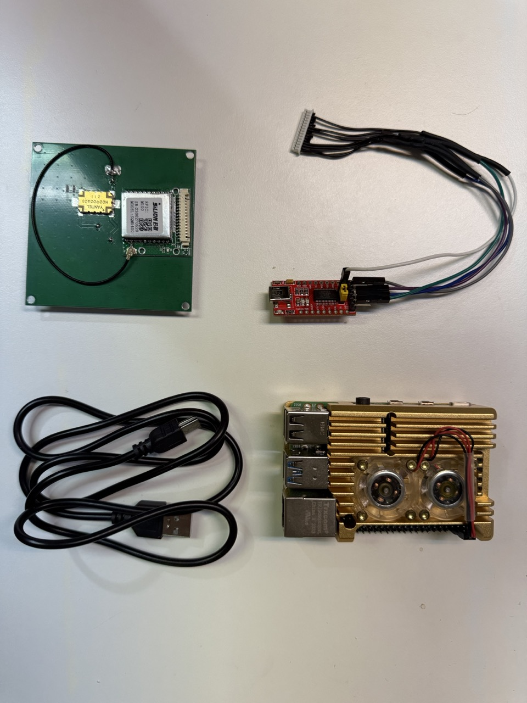
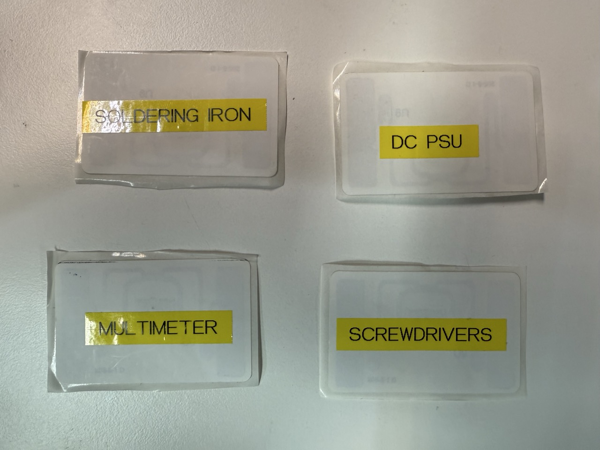
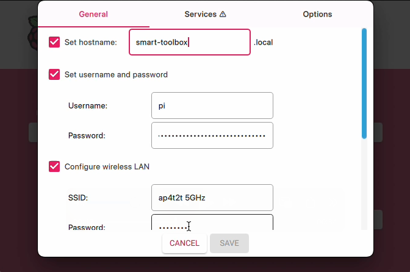
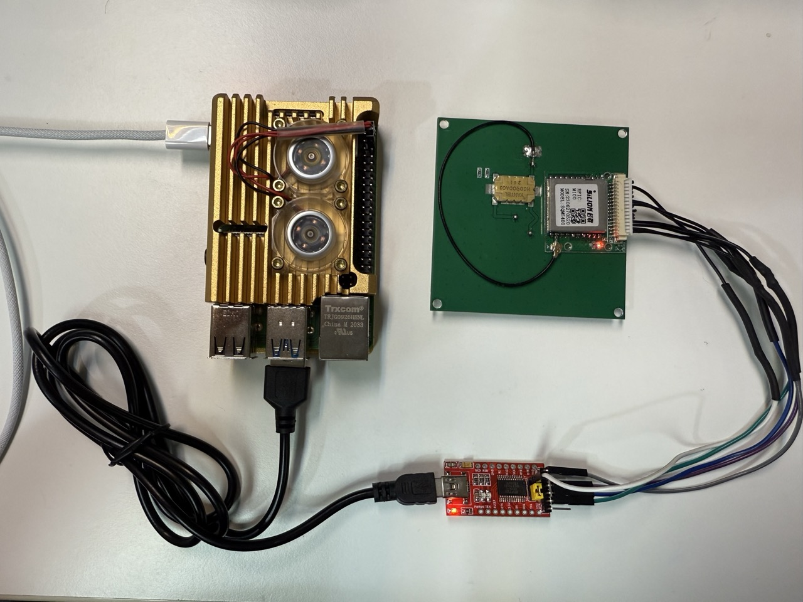

# **Smart Toolbox**

This project is a web-based application for tracking RFID tags. It uses a Node.js backend to communicate with an RFID reader via a serial port and a simple front-end to display real-time inventory updates.

The application supports different modes of operation, including an inventory mode that filters scanned tags against a predefined inventory list, and a read-tag mode to simply display the EPC of a scanned tag.

## **How it Works**

The system operates as a single-process application:

1.  **Server Initialization**: When index.js starts, it launches an Express web server and a WebSocket server.
2.  **Serial Port Communication**: It connects directly to the specified serial port, handling low-level RFID protocol bytes.
3.  **Inventory Loading**: If configured, it reads the inventory.csv file and loads the EPCs and item names into an in-memory map.
4.  **Web Client Interaction**: A user opens index.html in their browser, which establishes a WebSocket connection.
5.  **Data Exchange**: When the user clicks "Start Scanning," a command is sent via WebSocket to the server. The server, in turn, sends the appropriate hex command to the RFID reader.
6.  **Real-time Updates**: As the RFID reader scans tags, the index.js script processes the data. It filters the results based on the inventory and refresh period, then sends a JSON payload to all connected web clients via WebSocket.
7.  **UI Refresh**: The app.js file on the client-side receives the JSON data, updates its internal state, and redraws the table on the webpage to reflect the latest scan results.
## **Folder Structure**

The project is organized into the following directory structure:

```

├── index.js                  \# Main application file (combines server and RFID logic)
├── README.md                 \# Project documentation
├── setup.sh                  \# Installation script
├── web-app
│   ├── app.js                \# Front-end JavaScript for real-time updates
│   ├── index.html            \# The main web page UI
│   └── style.css             \# Styling for the web page
└── work
└── inventory.csv         \# Main inventory list for all other items

```

## **Files Overview**

* **index.js**: This is the core of the application. It runs a web server with a WebSocket gateway and directly manages the serial communication with the RFID reader. It handles the RFID protocol, processes incoming data, and sends updates to the connected web clients.
* **web-app/index.html**: The single-page web interface. It contains a table to display the inventory status, buttons to control the scanning process, and a status indicator for the WebSocket connection.
* **web-app/app.js**: The client-side logic. It establishes a WebSocket connection with the server, listens for inventory updates, and dynamically updates the table on the webpage. It also handles user interaction with the "Start" and "Stop" buttons.
* **web-app/style.css**: The stylesheet for the web interface, providing a clean and responsive design.
* **work/inventory.csv**: A CSV file containing the master list of RFID tags to be tracked. The columns are id, EPC, and item.
* **setup.sh**: A script to automate the installation of dependencies.

## **Usage**

### **Prerequisites**

Before you begin, ensure you have the following hardware:

#### **Hardware:**
* A Raspberry Pi 4
* An RFID reader module (e.g., model KLM900P with antenna)
* A USB to UART cable and a 15-pin ribbon cable for connecting the reader to the Pi
* A microSD card for the Raspberry Pi's operating system (A 32GB microSD card is recommanded)
 

* UHF RFID tags for your items
 

### **Initial Setup**

1.  **Install Raspberry Pi Imager**: Download and install the [Raspberry Pi Imager](https://www.raspberrypi.com/software/) on your computer.
2.  **Flash the OS Image**: Use the imager to flash the **Raspberry Pi OS (64-bit)** onto your microSD card. Before writing the image, click the settings icon (⚙️) to configure the OS. Make sure to:
   * Set the hostname to `smart-toolbox.local` .
   * Configure your Wi-Fi SSID and password to make Raspberry Pi connect to your WiFi AP.
 
3.  **Boot the Pi**: Insert the microSD card into your Raspberry Pi and power it on. Then connect the hardware as in the picture below: 
 
4.  **Login the Pi**: Wait for 1 minute and login the Pi with the following command if it is connected to the WiFi AP and the hostname is set to `smart-toolbox.local` properly. (The password is `raspberry` by default)
 


```bash
ssh pi@smart-toolbox.local
```

Then, git clone the code with the following command

```bash
git clone https://github.com/clementyu/smart-toolbox.git
```

After cloning the source code, navigate to the project directory, make the setup script executable, and run it.

```bash
cd smart-toolbox
chmod +x setup.sh
./setup.sh
source ~/.bashrc
cp ./env-sample.md ./.env
```

### **Preparing the Inventory**

The application uses an inventory file to identify items. You must create this file and populate it with your RFID tag information.

1.  Open the **`work/inventory.csv`** file in a text editor or spreadsheet program.
2.  Populate the file with three columns, separated by commas: **`id`**, **`EPC`** (the unique code from your RFID tag), and **`item`** (the item name, e.g., "multimeter" or "DC-PSU"). For example:

```csv
id,EPC,item
9,E28069150000401F7AB919BB,soldering-iron
10,E28069150000501F7AB911BB,screwdrivers
11,E28069150000401F7AB90DBB,multimeter
12,E28069150000501F7AB8FDBB,DC-PSU
```

#### Note 
If you don't know the EPC of the RFID tag you are using, you can 
1. Put the tag on top of the RFID scanner's antenna and keep the rest RFID tags wrapped with the tin foild or in a metal box. 
2. Go through the rest step and launch the host. 
3. Click `Read Tag` on the webpage http://smart-toolbox.local:8080 and the EPC of the RFID tag will be revealed on the field `Last Scanned EPC`. 
4. Press `Export Inventory` button, update inventory.csv, and then press `Import Inventory` button to upload the updated inventory.csv. 


### **Running the Application**

To start the application, run the index.js file with Node.js.

```bash
node index.js --mode=inventory --inventory=./work/inventory.csv --refresh-period=3 --dbg=1 -p /dev/ttyUSB0 -b 115200
```

By default, the application will start in inventory mode and check for the inventory.csv file. The `web interface` will be available at http://smart-toolbox.local:8080 .

### **Command-Line Arguments**

You can customize the application's behavior using the following command-line arguments:

| Argument | Description | Example |
| :---- | :---- | :---- |
| --mode=\<mode\> | Sets the operational mode. Available modes are `auto`, `inventory`, `interactive` and `read-tag`. | --mode=inventory |
| --inventory=\<path\> | Specifies the path to the inventory CSV file. This is mandatory for inventory mode. | --inventory=./work/inventory.csv |
| --refresh-period=\<seconds\> | Sets the time interval (in seconds) for updating the log on the web page. | --refresh-period=5 |
| --dbg=\<0 or 1\> | Enables or disables debug logs. 0 turns logs off, 1 turns them on. Debug logs are on by default. | --dbg=0 |

### **Using the Web Interface**

1.  Open a web browser on any device on the same network as your Raspberry Pi.
2.  Navigate to **`http://smart-toolbox.local:8080`**.
3.  The web page will display an **Item Summary** and a detailed **All Scanned EPCs** table.
4.  Click the **"Start Scanning"** button to begin the scan session.
5.  Click the **"Read Tag"** button to reveal the EPC of a scanned tag which is not on the inventory.csv.
6.  Click **"Stop Scanning"** to end the session. This will also trigger the saving of a detailed log.
7.  Click **"Import Inventory"** to upload a new `inventory.csv` file.
8.  Click **"Export Inventory"** to download the current `inventory.csv` file.

To **gracefully shut down** the application, press `Ctrl+C` in the terminal where the program is running. A log file named **`epc_scan_data.tsv`** will be saved in your project's root directory.


### [Optional] Make the server running once Raspberry Pi is powered on
Use the following command to launch the Smart Toolbox webserver and RFID scanning while Raspberry Pi booted up. 

* Install pm2

```bash
sudo apt install nodejs npm
sudo npm install -g pm2
```

* Enable pm2 auto-statup  
```bash
pm2 startup
```

Then you will be prompt a command to enable auto-startup. Copy and paste the command and launch as below. The following command line was what I've received. It might be different in your environment.  

```bash
sudo env PATH=$PATH:/home/pi/.nvm/versions/node/v22.18.0/bin /usr/local/lib/node_modules/pm2/bin/pm2 startup systemd -u pi --hp /home/pi
```

```bash
cd /home/pi/smart-toolbox
pm2 start index.js -- --port /dev/ttyUSB0 --baudrate 115200
pm2 save
sudo reboot -p
```
